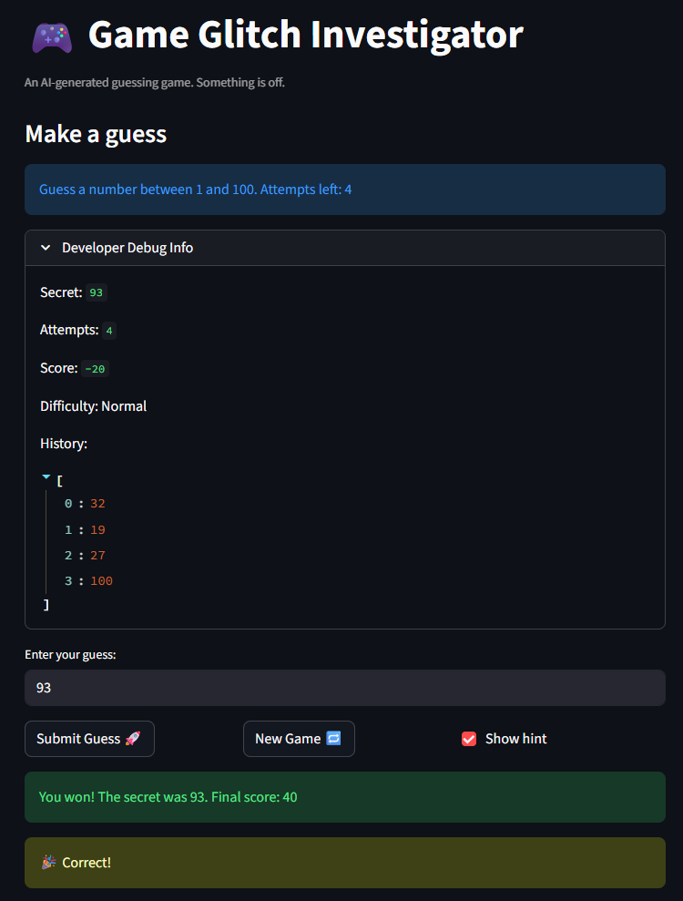

# 🎮 Game Glitch Investigator: The Impossible Guesser

## 🚨 The Situation

You asked an AI to build a simple "Number Guessing Game" using Streamlit.
It wrote the code, ran away, and now the game is unplayable. 

- You can't win.
- The hints lie to you.
- The secret number seems to have commitment issues.

## 🛠️ Setup

1. Install dependencies: `pip install -r requirements.txt`
2. Run the broken app: `python -m streamlit run app.py`

## 🕵️‍♂️ Your Mission

1. **Play the game.** Open the "Developer Debug Info" tab in the app to see the secret number. Try to win.
2. **Find the State Bug.** Why does the secret number change every time you click "Submit"? Ask ChatGPT: *"How do I keep a variable from resetting in Streamlit when I click a button?"*
3. **Fix the Logic.** The hints ("Higher/Lower") are wrong. Fix them.
4. **Refactor & Test.** - Move the logic into `logic_utils.py`.
   - Run `pytest` in your terminal.
   - Keep fixing until all tests pass!

## 📝 Document Your Experience

- [x] Describe the game's purpose.

**Game purpose:** A number guessing game where the player picks a difficulty, then tries to guess a randomly chosen secret number within a limited number of attempts. Each guess earns or loses points, and the game gives high/low hints after every guess.

- [x] Detail which bugs you found.

**Bugs found:**
1. Hints were reversed — "Go HIGHER" appeared when the guess was too high, and vice versa.
2. The "New Game" button didn't reset `status` or `history`, so the game stayed locked on "You already won" after a win.
3. Wrong guesses on even-numbered attempts rewarded +5 points instead of deducting them.
4. Clicking "New Game" always generated a secret from 1–100, ignoring the selected difficulty.
5. The info banner always said "Guess a number between 1 and 100" regardless of difficulty.
6. Invalid inputs (letters, blank field) still consumed an attempt before validation ran.
7. The Hard difficulty range (1–50) was smaller and easier than Normal (1–100).
8. The score was never reset when starting a new game, carrying over between rounds.
9. Hints disappeared after any page interaction because they weren't stored in session state.

- [x] Explain what fixes you applied.

**Fixes applied:**
- Corrected the hint direction in `check_guess` so "Too High" → "Go LOWER" and "Too Low" → "Go HIGHER".
- Added `st.session_state.status = "playing"`, `history = []`, and `score = 0` to the New Game reset block.
- Removed the even-attempt score bonus; wrong guesses always deduct 5 points now.
- Changed the New Game secret generation to use `random.randint(low, high)` based on difficulty.
- Updated the info banner to use the actual `low`/`high` range variables.
- Moved `st.session_state.attempts += 1` inside the valid-guess branch so invalid inputs don't waste turns.
- Changed the Hard difficulty range to 1–200 to make it genuinely harder than Normal.
- Persisted the last hint in `st.session_state.last_hint` and rendered it outside the submit block so it survives reruns.

## 📸 Demo

- [x] [Insert a screenshot of your fixed, winning game here]

## 🚀 Stretch Features

- [ ] [If you choose to complete Challenge 4, insert a screenshot of your Enhanced Game UI here]
